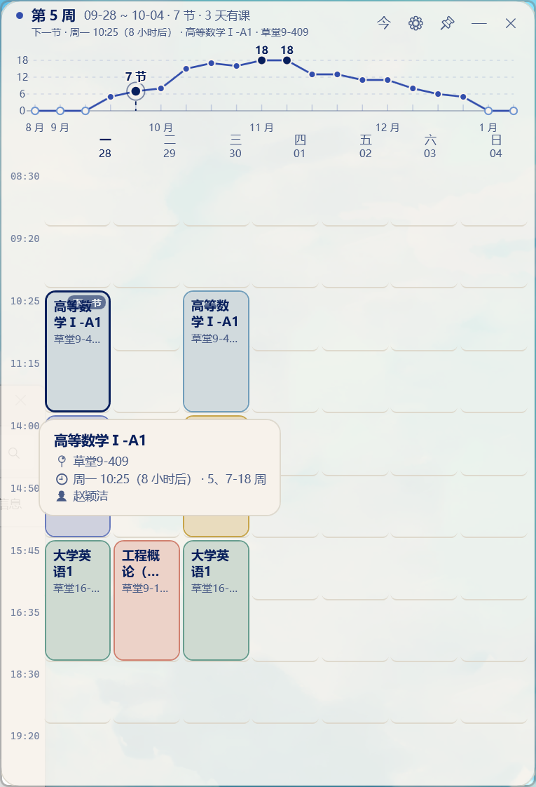

# XAUAT-Classes

西安建筑科技大学（XAUAT）课表桌面组件 —— 一个 Windows 上的**只读**课表小工具。
WPF / .NET 10 原生实现，半透明圆角窗口，内置教务系统（统一身份认证）抓取通道。

A read-only desktop schedule widget for Xi'an University of Architecture and Technology.
Native WPF on .NET 10, translucent rounded window, with a built-in scraper for the school's
academic system (unified identity authentication).

---

## 特性

- **首次运行即登录**：输入学号与密码，程序自动完成统一身份认证并抓取整学期课表；之后每次打开直接进展示页。
- **半透明圆角窗口**：分层窗口像素级 alpha，圆角由 DWM 提供；启动默认居中。
- **学期负载折线**：每周课时曲线同时就是周次导航器 —— 拖动或点线上任意一点切周。
- **下一节高亮**：标题栏写着"下一节 · 周几 时间（距今多久）· 课程名 · 教室"，课表里那节课带呼吸光晕。
- **课程悬浮框**：点课程弹出小卡片，显示课程名 / 教室 / 上课时间（含距今时间）/ 教师；鼠标移开自然淡出。
- **亮 / 暗两套主题**：一键切换。
- **设置里只有三样**：主题、刷新课表、退出登录。
- **托盘常驻**：显隐、置顶、开机自启、重置位置、退出。
- 明确**不提供**课程编辑：课表只读，数据只来自教务系统。

## 界面



## 运行

两种方式：

1. **自包含单文件**：`dotnet publish` 出来的 `XAUAT-Classes.exe`（约 166 MB）双击即用，不需要安装 .NET 运行时。
2. **自己编译**：

```bash
# 需要 .NET 10 SDK
dotnet publish src/../XauatSchedule.csproj -c Release -r win-x64 --self-contained true \
  -p:PublishSingleFile=true -p:PublishReadyToRun=true -p:IncludeNativeLibrariesForSelfExtract=true \
  -o publish
```

## 它是怎么拿到课表的

程序完整复刻了浏览器里的流程（没有任何凭据硬编码，也不需要随包数据）：

```
1) GET  /student/sso/login                          → 302 到统一身份认证平台
2) GET  /authserver/login                           → 取 salt / execution / lt
3) GET  /authserver/checkNeedCaptcha.htl            → 需要验证码就把图显示给用户
4) POST /authserver/login                           → 密码 AES-128-CBC 加密（明文前补 64 位随机串）
5) 跟随 ticket 回跳                                  → 建立教务系统会话（两个域名各自一个 cookie 罐）
6) GET  /student/for-std/course-table               → 页面里带 stdPersonId 与学期列表
7) GET  /student/for-std/course-table/get-data      → lessonIds / timeTableLayoutId / currentWeek
8) POST /ws/schedule-table/timetable-layout         → 真实节次时间表（12 节）
9) POST /ws/schedule-table/datum                    → 逐周取课表（20+ 周）
```

### 关于反爬

遇到任何人机校验（图片验证码、滑块、风控、访问频率限制），程序**不做任何绕过**：
图片验证码直接显示在登录页由用户填写；其它校验则原样展示服务器返回的提示，
并提供「在浏览器里打开」与「完成，重试」两个按钮，由用户自己处理。

## 技术要点

| 方面 | 做法 |
| --- | --- |
| 窗口 | WPF 无边框 + 分层窗口 alpha（真半透明）+ DWM 圆角 |
| 动画 | 自研弹簧引擎（解析解、帧率无关、可中断），只动 `RenderTransform` / `Opacity` |
| 手写 | 全部自绘：负载折线、课表网格、悬浮框、托盘图标 |
| 依赖 | 零第三方 NuGet 依赖（仅 .NET 自带 WPF + WinForms 托盘 + Win32 互操作） |
| 凭据 | 密码用 Windows DPAPI 加密后存本机（`%AppData%\XAUAT-Classes\schedule.json`），只有当前 Windows 账户能解开 |
| 打包 | 自包含单文件（约 166 MB，WPF 不支持裁剪，这是该技术路线的下限） |

## 快捷键

| 键 | 作用 |
| --- | --- |
| `←` / `→` | 上一周 / 下一周 |
| `Home` | 回到本周 |
| `Esc` | 关闭面板 / 收起悬浮框 |
| 双击标题栏 | 折叠成小条 |

## 目录

```
Core/        模型、周次换算、本地存储、配色 token
Services/    教务系统抓取（SSO 登录 + 引导 + 逐周抓取）
Animation/   弹簧动画引擎
Native/      DWM 圆角 / 分层窗口 / 开机自启 / 托盘 / DPAPI
Controls/    课表网格、负载折线（自绘）
Views/       主窗口
Themes/      颜色与控件样式
Resources/   应用图标（多尺寸 .ico）
```

## 许可

MIT，见 [LICENSE](LICENSE)。配色取自开源 skill `lieflat-charts` 的 porcelain / graphite
色板，出处与授权见 [THIRD_PARTY_NOTICES.md](THIRD_PARTY_NOTICES.md)。

## 免责

仅供个人查看自己的课表使用。请遵守学校相关管理规定，不要用于批量抓取或任何越权用途。
